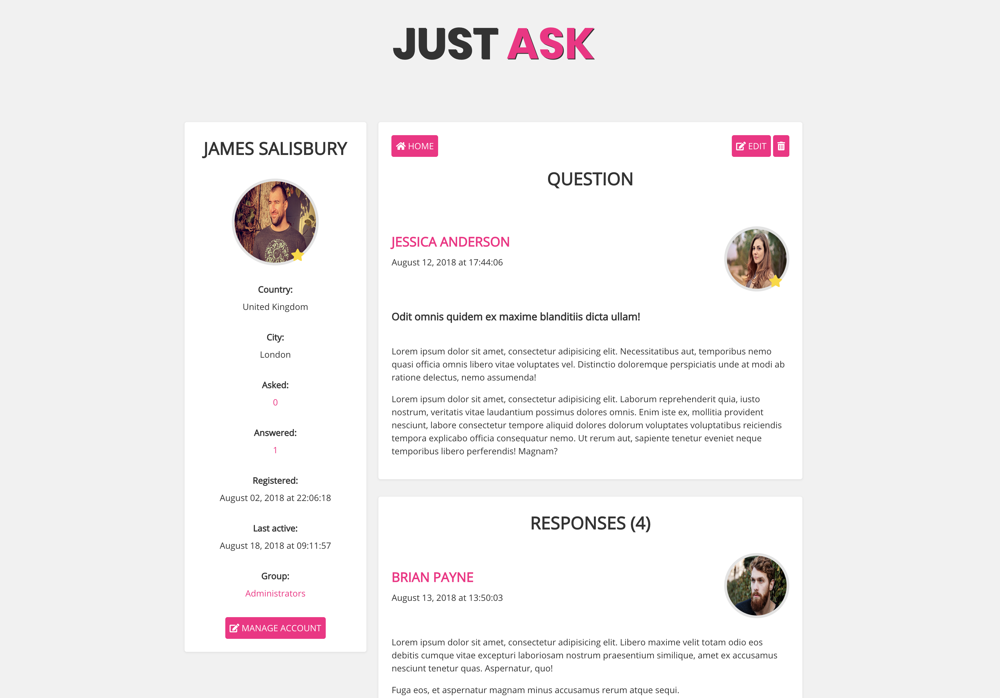

JustAsk Discussion Platform
=======================

Personal discussion platform project. Based on flexbox layout, html5 and modern css3 principes with a little bit of php.

This project is used as a little demonstration of my skills and for evolving my knowledge as a full stack web developer.

You can modify and use this project or certain components if you wish.

For any questions feel free to contact me at me@mwardew.com   

 

 

 

Requirements
============

* Sass >= 3.5.5 (Bleeding Edge)

Meta
============

Mark Wardew alias mwardew – [@markwardew](https://twitter.com/markwardew) – me@mwardew.com

[https://github.com/mwardew/github-link](https://github.com/mwardew/)