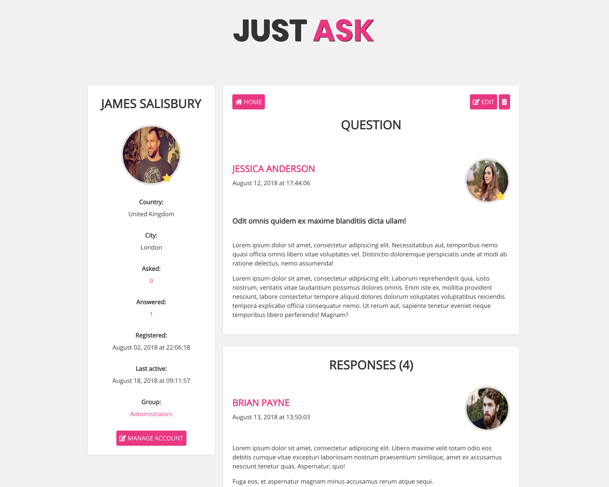

# **Just Ask Template**

This project is created only with HTML &amp; CSS.

<br>



<br>

## Installation

Use these commands to clone repository.

1. **Clone from Github**

   ```
   $ git clone git@github.com:devmaroy/justask-template_cu_pe_st_hc_en.git
   ```

2. **Navigate into your directory where you cloned repository**

   ```
   $ cd my-folder
   ```

**You can use live-server npm package if you want to serve this website!**

<br>

## Structure

A quick look at the top-level files and directories you'll see in my project.

    .
    ├── favicon
    ├── src
    ├── screenshot.png
    ├── README.md
    └── *.html

<br>

1.  **`/favicon`**: This directory contains all of the images and files necessary for favicon.

2.  **`/srs`**: This directory contains all important directories - styles, images.

3.  **`screenshot.png`**: Screenshot of the final website.

4.  **`README.md`**: A text file containing useful reference information about
    project.

5.  **`.html`**: Bunch of important html pages.

<br>

<hr>

<br>

### Live example:

**[justask-template.marekmatejovic.com](https://justask-template.marekmatejovic.com)**

<br>

Created by **[@devmaroy](https://twitter.com/devmaroy)** feel free to contact me

e-mail: **[hello@devmaroy.com](mailto:hello@devmaroy.com?subject=[GitHub]%20justask-template_cu_pe_st_hc_en)**
